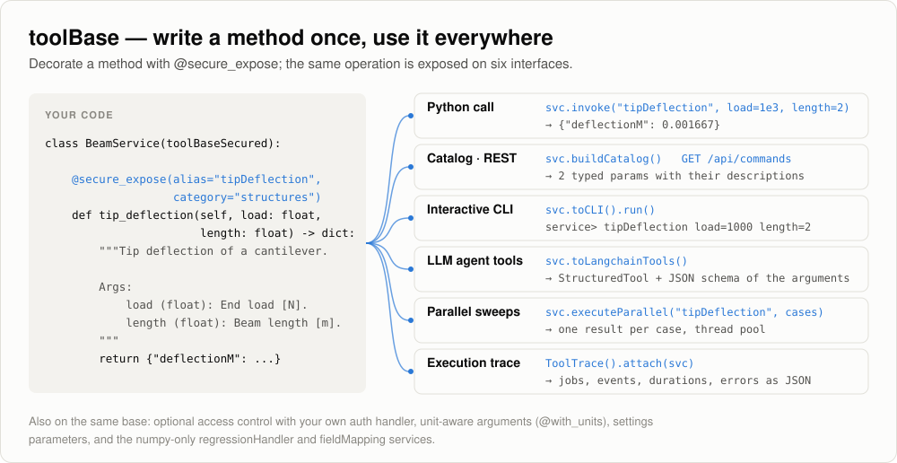

# pythonLibs

A small, dependency-light Python foundation for engineering tools:

- **toolBase** — write a method once and call it from Python, a command catalog,
  REST, an interactive CLI or an LLM agent, with parallel runs and execution traces.
- **regressionHandler** — regression and surrogate modelling (1-D to N-D, 30+ model
  types) with prediction intervals, gradients and cross-validation, on numpy only.
- **fieldMapping** — conservative transfer of field data (e.g. heat flux, temperature)
  between non-matching meshes, with VTU input and output, on numpy only.
- small **utility packages** for files, dicts, JSON / YAML / TOML / XML, tables,
  units, dates and methods.

Released into the public domain (Unlicense).

<picture>
  <source media="(prefers-color-scheme: dark)" srcset="docs/images/toolBase-dark.svg">
  
</picture>

## Contents

| Package | What it does | Guide |
|---|---|---|
| `tool` | toolBase / toolBaseSecured: expose methods as commands on every interface | [tool/README.md](tool/README.md) |
| `regressionHandler` | regression, Kriging / GP, GLM / GAM, splines, RBF, trees, constraints, validation | [regressionHandler/README.md](regressionHandler/README.md) |
| `fieldMapping` | mesh I/O, finite-element integration, conservative surface flux transfer, 1-D profiles to 3-D | [fieldMapping/README.md](fieldMapping/README.md) |
| utilities | `fileHandler`, `dictHandler`, `jsonHandler`, `yamlHandler`, `tomlHandler`, `xmlHandler`, `tableHandler`, `dataHandler`, `dateTimeHandler`, `docstringHandler`, `MethodHandler`, `os` | [below](#utility-packages) |

## Install

```bash
git clone https://github.com/KeiichiroFujimoto/pythonLibs.git
cd pythonLibs
pip install -e .                 # core: toolBase, regressionHandler, fieldMapping, utilities
pip install -e ".[rest]"         # + FastAPI / uvicorn for the REST example
pip install -e ".[llm]"          # + LangChain for LLM agent tools
pip install -e ".[all]"          # everything
```

The repository root is the `pythonLibs` package, so imports always start with
`pythonLibs.` (for example `from pythonLibs.regressionHandler import createModel`).
Python 3.10 or newer.

## toolBase in one minute

Subclass `toolBaseSecured` and mark the methods you want to offer with
`@secure_expose`. The docstring and the type hints become the command description
and its argument schema.

```python
from pythonLibs.tool.decorators import secure_expose
from pythonLibs.tool.toolBaseSecured import toolBaseSecured
from pythonLibs.tool.ToolTrace import ToolTrace


class BeamService(toolBaseSecured):
    def __init__(self):
        # instance_subcls=self: read "Args:" descriptions from the docstrings
        # secure_enabled=False: no access control (see tool/README.md to plug in your own)
        super().__init__(instance_subcls=self, exposure_mode="expose_only", secure_enabled=False)

    @secure_expose(alias="tipDeflection", category="structures")
    def tip_deflection(self, load: float, length: float, e_modulus: float = 200e9, inertia: float = 8e-6) -> dict:
        """Tip deflection of a cantilever beam under an end load.

        Args:
            load (float): End load [N].
            length (float): Beam length [m].
            e_modulus (float): Young's modulus [Pa].
            inertia (float): Second moment of area [m^4].
        """
        return {"deflectionM": load * length ** 3 / (3.0 * e_modulus * inertia)}


svc = BeamService()

# 1. Python call by alias (keyword names may be camelCase or snake_case)
print(svc.invoke("tipDeflection", load=1000.0, length=2.0))        # {'deflectionM': 0.00166...}

# 2. JSON command catalog: the basis of REST endpoints, GUIs and remote CLIs
command = svc.buildCatalog()[0]
print(command["id"], [(p["name"], p["type"], p["description"]) for p in command["params"]])

# 3. Parameter sweep on a thread pool
cases = [{"load": 1000.0, "length": length} for length in (1.0, 1.5, 2.0)]
print(svc.executeParallel("tipDeflection", cases))

# 4. Execution trace: every invoke is recorded with timing and status
trace = ToolTrace()
trace.attach(svc)
svc.invoke("tipDeflection", load=500.0, length=1.0)
print(trace.to_dict()["jobs"][0]["status"])                          # completed
```

The same service, without further code:

```bash
# interactive CLI:     svc.toCLI().run()
service> tipDeflection load=1000 length=2
{
  "deflectionM": 0.0016666666666666668
}
```

- **LLM agents**: `svc.toLangchainTools()` returns LangChain `StructuredTool`s with a
  JSON schema per command (needs the `llm` extra).
- **REST**: [tool/examples/restServer.py](tool/examples/restServer.py) serves any
  service with FastAPI (`GET /api/commands`, `POST /api/commands/invoke`);
  `python -m pythonLibs.tool http://127.0.0.1:8322` opens the CLI on it remotely.

More in [tool/README.md](tool/README.md): access control, units, settings,
combining services, the command-line REPL.

## regressionHandler in one minute

<picture>
  <source media="(prefers-color-scheme: dark)" srcset="docs/images/regressionHandler-dark.svg">
  
</picture>

```python
import numpy as np
from pythonLibs.regressionHandler import createModel, crossValidate, loadModel

rng = np.random.default_rng(0)
x = rng.uniform(0.0, 10.0, (30, 1))                                  # inputs, shape (n, nInputs)
y = np.sin(x[:, 0]) + 0.1 * x[:, 0] + rng.normal(0.0, 0.05, 30)      # outputs, shape (n,) or (n, nOutputs)

model = createModel("kriging").fit(x, y)                             # or "quadratic", "gam", "rbf", ...
xNew = np.linspace(0.0, 10.0, 5)[:, None]
band = model.predictInterval(xNew, level=0.95, kind="prediction")    # band.mean, band.lower, band.upper
slope = model.predictGradient(xNew)                                  # (m, nInputs, nOutputs)
cv = crossValidate(model, x, y, method="analytic")                   # exact leave-one-out
print(model.summary())
print("LOO RMSE:", cv.rmse)

model.save("model.json")                                             # portable JSON, no pickle
same = loadModel("model.json")
assert np.allclose(same.predict(xNew), model.predict(xNew))
```

See [regressionHandler/README.md](regressionHandler/README.md) for the model catalogue,
physics constraints, model selection and the service commands.

## fieldMapping in one minute

<picture>
  <source media="(prefers-color-scheme: dark)" srcset="docs/images/fieldMapping-dark.svg">
  
</picture>

```python
import numpy as np
from pythonLibs.fieldMapping import SurfaceFluxMapper, planeSurface

source = planeSurface(n=(23, 17), cellType="triangle", jitter=0.3)   # e.g. a CFD surface
target = planeSurface(n=(7, 9), cellType="quad", jitter=0.2, seed=1) # e.g. a structural surface
centers = source.cellCentroids()
flux = np.sin(6.0 * centers[:, 0]) + 0.3 * centers[:, 1] - 0.15      # heat flux per source cell, both signs

mapper = SurfaceFluxMapper(source, target)                           # overlap geometry, built once
result = mapper.map(flux, "cell")                                    # call again for every time step
d = result.diagnostics
print(d["sourceHeatIn"], d["targetHeatIn"])                          # equal to round-off
print(d["sourceHeatOut"], d["targetHeatOut"])
print(result.cellFlux.shape, result.nodalLoads.shape)                # per target cell, per target node
```

Real meshes come from VTU files: `readVtu("surfaceFlux.vtu")`, `writeVtu(...)`. See
[fieldMapping/README.md](fieldMapping/README.md) for volume meshes, the reverse
direction, coupling iterations, 1-D layer profiles and the command line.

## Utility packages

| Package | Main entry points | Typical use |
|---|---|---|
| `fileHandler` | `FileHandler`, `FilePathHandler`, `FileFinder`, `TemporaryDirectoryManager` | copy / find files, work directories, path parts |
| `dictHandler` | `DictHandler`, `DictBase`, `DictPath` | flatten / unflatten, dict <-> XML / TOML, path access |
| `jsonHandler` | `JsonHandler`, `JsonExtractor`, `JsonSanitizer` | read / write JSON, pull a JSON object out of LLM text |
| `yamlHandler`, `tomlHandler`, `xmlHandler` | `YamlHandler`, `TomlHandler`, `LxmlHandler` | read / write configuration files |
| `tableHandler` | `TableHandler` | numpy / pandas tables, `name[unit]` column headers, Excel output |
| `dataHandler` | `DataHandler`, `DataItem`, `UnitHandler`, `VariableMapper` | typed data columns with units, alias mapping |
| `dateTimeHandler` | `DateTimeHandler` | parsing, UTC / JST, Unix time, Julian dates, overlaps |
| `docstringHandler` | `DocstringHandler` | parse Google-style `Args:` sections |
| `MethodHandler` | `MethodInspector`, `MethodExecutor`, `MethodExecutorAsyncRetry` | reflection, dynamic calls, async retries |
| `os` | `osChecker`, `portInspector`, `processUtils` | OS checks, who uses a port, process termination |

```python
from pythonLibs.tool.units_decorator import with_units
from pythonLibs.dictHandler import DictHandler
from pythonLibs.jsonHandler import JsonExtractor
from pythonLibs.dateTimeHandler import DateTimeHandler


@with_units(thickness="mm->m", pressure="MPa->Pa")                   # convert before the call
def hoopStress(radius, thickness, pressure):
    return pressure * radius / thickness

print(hoopStress(radius=0.5, thickness=5.0, pressure=2.0))           # 2.0e8 Pa

print(DictHandler.flatten_dict({"solver": {"cfl": 0.8, "steps": 100}}))   # {'solver.cfl': 0.8, 'solver.steps': 100}
print(JsonExtractor.extract_json_dict('Result:\n```json\n{"load": 1000}\n```'))  # {'load': 1000}
print(DateTimeHandler.to_julian_date(DateTimeHandler.parse("2000-01-01T12:00:00Z")))  # 2451545.0
```

## Tests

```bash
pip install -e ".[all]" pytest
python -m pytest tests regressionHandler/tests fieldMapping/tests -q
```

`tests/test_documentationExamples.py` runs the Python examples of this README and of
[tool/README.md](tool/README.md), so the documentation stays executable.

## Images

The overview images are generated from real runs of the library:

```bash
python -m pythonLibs.docs.images.makeReadmeImages
```

## Scope

Domain packages (aerospace, world models, CAD, agents, application services) and
login / password / JWT / user-database implementations are intentionally not
included. Applications inject their own verifier when they need access control.

## License

This project is released into the public domain under the Unlicense.
