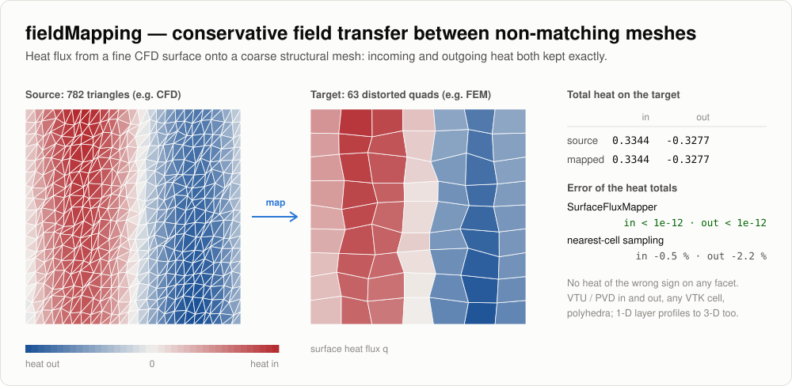

# fieldMapping

<picture>
  <source media="(prefers-color-scheme: dark)" srcset="../docs/images/fieldMapping-dark.svg">
  
</picture>

Conservative transfer of field data between non-matching meshes, built on numpy and
the Python standard library only.

- **VTU / PVD** reading and writing (`io`): every encoding VTK writes (ascii, inline
  binary, appended raw / base64, zlib or lzma compression, 32 / 64-bit headers,
  several pieces) and arbitrary polyhedra in both the classic `faces` layout and the
  newer face-connectivity layout.
- **Unstructured meshes** (`mesh`): linear and quadratic VTK cells (line, triangle,
  quad, tetra, hexahedron, wedge, pyramid; quadratic edge, triangle, quad, tetra,
  hexahedron, wedge; biquadratic quad), polygons and polyhedra (also non-convex; face
  orientation is repaired). Finite-element integration with exact quadrature on the
  curved geometry, consistent load vectors, boundary and material-interface surfaces
  with outward orientation (inverted cells handled).
- **Conservative surface flux transfer** (`SurfaceFluxMapper`): common refinement of
  the two surfaces, incoming and outgoing heat conserved separately to round-off,
  no heat of the wrong sign, automatic normal orientation, cell / nodal-load / nodal
  flux outputs.
- **Energy-conserving mapping of layered 1-D profiles** (`LayeredProfileMapper`):
  through-thickness temperature histories computed at several surface stations are
  mapped onto a 3-D mesh (every node and every cell of the layers gets a temperature)
  with surface-anchored depth, Kriging between stations and exact conservation of thermal energy (temperature-dependent cp) per
  station region and layer, without new extrema.
- **File input and command line** (`StationIO`, `python -m pythonLibs.fieldMapping`):
  station results as CSV tables listed in a JSON manifest, materials as JSON.
- **toolBase service** (`FieldMappingHandler`): the same operations as commands on
  .vtu / .pvd files.

## Layout

```text
fieldMapping/
  io/Vtu.py               readVtu, writeVtu, readPvd, writePvd
  mesh/Elements.py        VTK cell library: shape functions, faces, quadrature (collapsed Gauss-Jacobi on simplices)
  mesh/Mesh.py            UnstructuredMesh, Quadrature, boundarySurface, interfaceSurface, triangulate
  mesh/Generators.py      structuredBox, planeSurface, sphereSurface, sphericalShell
  Geometry.py             box pair search, polygon clipping, closest points
  SurfaceFluxMapper.py    conservative, sign-preserving surface flux transfer
  LayeredProfileMapper.py layered 1-D profiles -> 3-D temperatures with energy conservation
  Coupling.py             FixedPointRelaxation: partitioned coupling iteration (constant / Aitken)
  Material.py             density and cp(T) with exact energy integrals
  StationIO.py            station manifest / CSV tables, materials JSON, example templates
  __main__.py             command line: info, template, layered, flux
  FieldMappingHandler.py  toolBaseSecured service (@secure_expose commands)
  tests/analytic/         closed-form verification
```

## Meshes and integration

```python
from pythonLibs.fieldMapping import readVtu, writeVtu

mesh = readVtu("structure.vtu")             # any cell types, polyhedra included
q = mesh.quadrature(order=4)                # points, physical weights, interpolation operator
volume = q.weight.sum()
energy = q.integrate(nodalField)            # = weights @ (interp @ nodalField)
loads = q.loadVector(valuesAtPoints)        # consistent nodal loads, int N_i f
outer = mesh.boundarySurface()              # outward faces, indexed by the volume points
layers = mesh.interfaceSurface(mesh.cellData["material"])
writeVtu("out.vtu", mesh)                   # appended raw + zlib by default
```

Polygons are integrated as triangle fans around their centroid and polyhedra as
tetrahedra (cell centroid, face centroid, edge): any linear field is reproduced
exactly and every closed polyhedron gets its exact volume (signed decomposition,
also for non-convex cells).

## Conservative surface flux transfer

```python
from pythonLibs.fieldMapping import SurfaceFluxMapper, readVtu

flow = readVtu("surfaceFlux.vtu")           # flux on facets (cell data) or nodes (point data)
structure = readVtu("structure.vtu")        # volume mesh: its boundary surface is the target
mapper = SurfaceFluxMapper(flow, structure) # geometry built once
res = mapper.map(flow.cellData["q"], "cell", reconstruction="linear", pointFlux=True)
res.diagnostics                             # heat in / out per side, dropped heat, peaks, coverage
res.nodalLoads                              # consistent nodal loads on the structure's nodes
res.attach(mapper.target)                   # cell flux, heat in / out, nodal loads, nodal flux
```

- **face-area weighting**: the heat of a source face is exactly q_f A_f, with the face
  area of the source solver's convention (`sourceArea`: "vector" = magnitude of the
  face-area vector as in finite-volume codes, "fan", "fe", or the solver's own face
  areas as a cell array; "auto" = vector for linear faces, fe for quadratic faces).
  The target flux is Q_t / A_t (`targetArea`, default "fe", consistent with the nodal
  loads), and the nodal flux is the tributary-area (A_f / n_f) weighted average of the
  adjacent face fluxes (`nodalWeighting="area"`). Quadrilaterals are split around
  their centroid, so warped faces have no preferred diagonal
- the source heat of every source triangle, split into its incoming (q > 0) and
  outgoing (q < 0) parts along the zero line of q, is distributed to the target
  facets in proportion to the integrals of q over their overlaps: incoming and
  outgoing heat are conserved separately and no facet gets heat of the wrong sign
- gaps (no overlap) go to the nearest facet within `maxDistance`; heat farther away
  (a target covering only part of the source) is reported as dropped
- `reconstruction="linear"` (cell data) uses a limited least-squares gradient that
  keeps the facet mean, the neighbour bounds and the sign: sharper coarse-to-fine
  transfer with the same conservation
- `pointFlux=True` adds nodal flux values: face-area weighted averages (or the
  HRZ-lumped L2 projection with `nodalWeighting="consistent"`) corrected by the
  conservative projection of `regressionHandler.constraints` so that
  sum_i a_i q_i equals the heat (incoming and outgoing parts separately with sign
  bounds, optional per-group heat constraints)
- the overlap geometry is computed once; `map` can be called for every time step

### Reverse direction and coupling iteration

```python
back = mapper.mapBack(structureWallT, "point")   # intensive field target -> source (same pieces)
back.pointValues, back.cellValues, back.cellCoverage, back.diagnostics

from pythonLibs.fieldMapping.Coupling import FixedPointRelaxation
relax = FixedPointRelaxation(omega=0.5, aitken=True, tolerance=1.0)
x, done = relax.update(x, F(x))                  # NaN entries (off the interface) are left alone
```

- `mapBack`: every source cell gets the overlap-area weighted mean of the target facet
  values (point input is reduced to facet means with the target quadrature); source nodes
  the covered-area weighted mean of their cells. The overlap integral is conserved to
  round-off, no new extrema; uncovered cells / nodes get `fill` (NaN). `pointCoverage` is
  the covered share of each node's support: a node on the edge of a target patch takes the
  value of the covered part, a nearby location, so compare or trust only nodes near 1
- `FixedPointRelaxation`: x <- x + w (F(x) - x), w constant or Aitken (Irons-Tuck),
  clipped to [omegaMin, omegaMax]; the per-iteration residuals are in `history`

## Energy-conserving mapping of layered 1-D profiles

```python
from pythonLibs.fieldMapping import LayeredProfileMapper, readVtu

structure = readVtu("structure.vtu")              # cells carry a layer label (cell array "layer")
stations = [{"position": [x, y, z],               # point on the outer surface
             "time": times,                       # (nt,)
             "depth": depth,                      # (nz,) or (nt, nz), below the current surface
             "interfaces": [0.0, 0.012, 0.030],   # layer boundary depths, (L + 1,) or (nt, L + 1)
             "temperature": T}                    # (nt, nz)
            for (x, y, z), depth, T in profiles]
materials = {1: {"density": 280.0, "cp": [[300, 1100], [2500, 2000]]},   # outer layer, cp(T) table
             2: {"density": 1600.0, "cp": 1000.0}}
mapper = LayeredProfileMapper(structure, stations, materials, layers=[1, 2])
res = mapper.map()                                # all station times (or map(times=[...]))
res.summary()                                     # max relative energy error, convergence
mapper.writeSeries(res, "temperature.pvd")    # point array and cell array "temperature"
```

1. **Depth coordinate**: a node in layer l gets xi = a / (a + b) from its distances
   to the upper and lower surfaces of that layer in the 3-D mesh (outer surface,
   material interfaces, inner surface; found from the layer labels). Each station
   maps xi into its own layer, so layer boundaries coincide even when 3-D and 1-D
   thicknesses differ (surface recession, design changes).
   - `depthMode="surfaceAnchored"` (default): in the outer layer the station depth is
     z = a (1 - xi) + xi^2 d, with a the node's distance from the outer surface and d
     the station's layer thickness, so the steep near-surface gradient keeps its true
     depth while the layer bottom still meets the interface. It falls back to the
     normalized depth where the 3-D layer is less than half the station's thickness.
   - `"layerNormalized"`: z = xi d in every layer. `"depth"`: z = a.
2. **Between stations**: weights of the node's foot point on the outer surface:
   ordinary Kriging (default; Matern 5/2 with the correlation length fitted by maximum
   likelihood to the stations' peak surface temperatures, or `lengthscale=` a number),
   inverse distance or nearest station. With 8 stations on a recessed prism-layer
   shell Kriging gave about a sixth of the inverse-distance error.
3. **Reference energy**: the continuous interpolated field is integrated with a
   high-order rule (`referenceOrder`), which resolves steep near-surface gradients that
   the 3-D mesh cannot hold nodally (a coarse through-thickness mesh loses 10-40 % of
   the energy by plain nodal interpolation).
4. **Conservation**: the nodal temperatures are corrected by the smallest change in the
   heat-capacity metric that makes the finite-element energy equal the reference energy
   in every group (`conservation`: station region x layer, layer, global or cell),
   nonlinear through cp(T), with every node kept inside the range of the station values
   around its depth. The final relative energy error is at round-off level.

`res.temperature` holds the nodal values (nt, nPoints), `res.cellTemperature` the
energy-equivalent cell values (nt, nCells): the temperature whose rho e(T) times the
cell volume equals the cell's finite-element energy (NaN outside the mapped layers).

The outer surface is found from the layer labels (faces of the outer layer facing away
from the first interface; with one layer, facing along the station normals); it can
also be given as a surface mesh (`outerSurface`).

### Station files

A JSON manifest lists the stations; the temperature history of each is a CSV table
(paths relative to the manifest):

```json
{"stations": [
  {"name": "S1", "position": [0.0, 0.0, 1.0], "interfaces": [0.0, 0.020, 0.025], "file": "S1.csv"},
  {"name": "S2", "position": [0.5, 0.0, 0.87], "interfacesFile": "S2_b.csv", "file": "S2.csv",
   "depthFile": "S2_depth.csv"}
]}
```

```text
# S1.csv: header = depths below the current surface [m], rows = time [s], temperatures [K]
time, 0.0, 0.0025, 0.005, ...
0,    300, 300,    300,   ...
30,   1050, 701.4, 514.9, ...
```

- `interfaces`: layer boundary depths [0, b1, ..., total] (one per 3-D layer label, outer
  first); `interfacesFile` gives them per time (rows `time, 0, b1, ..., total`) when the
  thickness changes by recession.
- `depthFile`: depths per time (same rows and columns as the temperature table) when
  the 1-D grid moves; the temperature header then only labels the columns (T1, T2, ...).
- Inline `time`, `depth`, `temperature` arrays are accepted instead of `file`.
- `#` starts a comment line; commas, semicolons, tabs or spaces separate values.

Materials JSON: `{"1": {"name": "ablator", "density": 280, "cp": [[300, 1000], [2000, 1800]]}, ...}`
(keys are the values of the layer cell array; cp a number or a [T, cp] table).

```python
from pythonLibs.fieldMapping import loadMaterials, loadStations
mapper = LayeredProfileMapper(structure, loadStations("stations.json"), loadMaterials("materials.json"))
```

## Command line

```bash
python -m pythonLibs.fieldMapping template work/                 # example stations.json, S1.csv, materials.json
python -m pythonLibs.fieldMapping info structure.vtu             # cell types, bounds, arrays, volume
python -m pythonLibs.fieldMapping layered --mesh structure.vtu --stations stations.json \
    --materials materials.json --layers 1 2 --out T.pvd --report report.json
python -m pythonLibs.fieldMapping flux --source flow.vtu --target structure.vtu --array q \
    --point-flux --out flux.vtu                                  # or --source-series flow.pvd --out flux.pvd
```

`layered` options: `--layer-array` (default `layer`), `--times`, `--weights`
(kriging / idw / nearest), `--lengthscale`, `--depth-mode`, `--conservation`.
`flux` options: `--location`, `--source-area`, `--target-area`, `--nodal-weighting`,
`--reconstruction`, `--group-array`, `--max-distance`, `--max-angle`, `--orientation`.
Each command prints a JSON summary with the conservation diagnostics (`--report` also
writes it to a file) and exits with status 1 and a message on bad input.

## toolBase service

```python
from pythonLibs.fieldMapping import FieldMappingHandler

fm = FieldMappingHandler()
fm.invoke("loadMesh", filePath="flow.vtu", meshName="flow")
fm.invoke("loadMesh", filePath="structure.vtu", meshName="structure")
fm.invoke("mapSurfaceFlux", sourceMesh="flow", targetMesh="structure", arrayName="q", pointFlux=True,
          outputFile="flux.vtu")                          # or sourceSeries="flow.pvd", outputFile="flux.pvd"
fm.invoke("mapLayeredProfiles", targetMesh="structure", stationsFile="stations.json",
          materials="materials.json", layers=[1, 2], outputFile="temperature.pvd")
```

| Command | Purpose |
|---|---|
| `loadMesh`, `listMeshes`, `meshSummary`, `deleteMesh`, `writeMesh` | .vtu meshes in named slots |
| `extractSurface` | boundary surface or material interfaces of a volume mesh |
| `mapSurfaceFlux` | conservative, sign-preserving flux transfer (single field or .pvd series) |
| `mapLayeredProfiles` | energy-conserving mapping of layered 1-D profiles, .pvd output |

The class auto-registers in `LabRegistry` as `fieldMapping`.

## Tests

```bash
python -m pytest fieldMapping/tests -q
```

`tests/analytic/` checks shape functions and quadrature exactness, exact volumes and
areas (also non-convex polyhedra), fourth-order geometry of quadratic cells, VTU round
trips, clipping and search kernels, and for the flux transfer: exact reproduction on
identical meshes, conservation per sign to round-off, second-order convergence under
refinement, partial targets and linear reconstruction; for the layered mapping: exact
reproduction of profiles linear within each layer (all cell types), layer-normalized
interface matching, energy conservation to round-off with bounds, reference energy
against the 1-D integral, curved multi-layer shells with every weighting, surface-anchored
depth after recession, cell energies and the Kriging length fit. `tests/test_stationFilesAndCli.py`
covers CSV / manifest input (equal to inline data, moving depth grids) and the command line.
