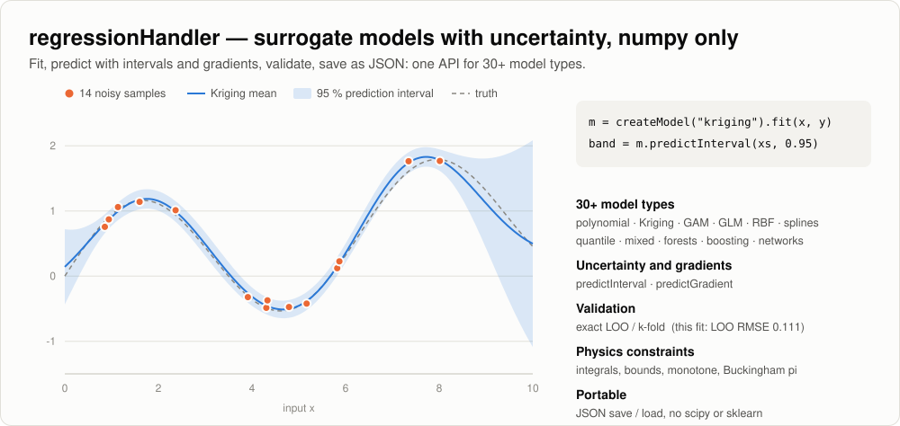

# regressionHandler

<picture>
  <source media="(prefers-color-scheme: dark)" srcset="../docs/images/regressionHandler-dark.svg">
  
</picture>

Regression and surrogate modelling, 1D to N-D, with multi-output support.
All algorithms (special functions, distributions, optimizers, B-splines,
kernels, solvers) are implemented here on top of numpy only.

Design principles:

- one template-method base class (`SurrogateModelBase`) with declared,
  validated options and `supports` capability flags
- gradients (`predictDerivatives`) and variances (`predictVariances`) as
  first-class outputs next to the mean prediction
- parameter inference (estimates, standard errors, t, p, confidence
  intervals, `summary()`) and cross-validation built in
- JSON persistence (no pickle), silent by default; large numeric arrays are
  embedded as exact, zlib-compressed binary blocks (``save(compact=True)``,
  the default), plain lists with ``compact=False``; files are strict JSON
  (NaN / Infinity stored as tagged values) and models saved without their
  training data keep their inference (intervals, summaries, term tests)

## Layout

```text
regressionHandler/
  RegressionHandler.py   toolBaseSecured service (@secure_expose commands)
  core/                  SurrogateModelBase, OptionsDictionary, Registry, FitResult, FitMetrics, SafeExpression
  numerics/              SpecialFunctions, Distributions, LinearAlgebra, Optimizers, PLS, NeighborSearch,
                         Trees (histogram trees), Sparse (coordinate sparse matrix)
  constraints/           linear functionals (values, derivatives, integrals, output balances, bounds, shape),
                         boundedQp, conservative projection (projectAffine / projectNonlinear),
                         Buckingham pi analysis
  glm/                   exponential families, links, penalized IRLS, GCV / UBRE smoothing selection
  bases/                 polynomial, orthogonalPolynomial, radial, bspline, expression, combined
  solvers/               ols, ridge (GCV/LOO), elasticNet, robust (IRLS), lars (sparse, LOO-selected)
  kernels/               squaredExponential, matern (any nu, fixed or estimated), matern32/52,
                         absoluteExponential, wendland, spherical, powerExponential,
                         rationalQuadratic, periodic, gneiting (space-time), warped / nonstationary,
                         sum/product with per-child columns (analytic gradients, ARD / PLS,
                         full anisotropy, fixed anisotropy matrix, great-circle distance)
  models/                LinearBasisModel, GlmModel, GamModel, QuantileModel, BayesianLinearModel,
                         HeteroscedasticModel, TransformedTargetModel, MixedModel, NonlinearModel, OdrModel,
                         KrigingModel (KPLS), CokrigingModel, ScalableKrigingModel, MultiFidelityKrigingModel,
                         GradientKrigingModel, RbfModel, IdwModel, SplineModel, ShapeSplineModel,
                         IsotonicModel, LocalRegressionModel (LOESS), RandomForestModel,
                         GradientBoostingModel, NeuralNetworkModel, ConstrainedModel, DimensionlessModel,
                         ModelLibrary, ModelFactory
  evaluation/            crossValidate (k-fold, threaded, analytic LOO), ModelSelector / defaultCandidates,
                         tuneHyperparameters, stepwiseSelect, diagnose, bootstrap, modelReport,
                         empiricalVariogram / fitVariogram, sobolIndices (PCE exact / Monte Carlo)
  sampling/              latinHypercube (maximin / ESE), fullFactorial, randomSampling, sobolLike,
                         benchmark problems (branin, rosenbrock, sphere, ackley, hartmann3/6, ishigami, friedman)
  tests/
```

## Python API

```python
import numpy as np
from pythonLibs.regressionHandler import createModel, crossValidate, loadModel

model = createModel("quadratic").fit(x, y)                 # x: (n, nx), y: (n,) or (n, ny)
model.predict(xNew)                                         # (m,) or (m, ny)
band = model.predictInterval(xNew, level=0.95, kind="prediction")
grad = model.predictGradient(xNew)                          # (m, nx, ny)
print(model.summary())                                      # R2, AICc, BIC + coefficient table
cv = crossValidate(model, x, y, nFolds=10)                  # or method="analytic" for exact LOO
model.save("model.json"); same = loadModel("model.json")     # large arrays stored as compressed binary blocks
```

Building blocks compose freely:

```python
from pythonLibs.regressionHandler import LinearBasisModel

LinearBasisModel(basis={"type": "orthogonalPolynomial", "degree": 8}, solver="ridge")          # stable RSM
LinearBasisModel(basis={"type": "bspline", "nSegments": 25},
                 solver={"type": "ridge", "penalty": "smoothness"})                              # P-spline (1-3D)
LinearBasisModel(basis={"type": "expression", "terms": ["x", "1/x**2", "log(x)"], "variables": ["x"]})
LinearBasisModel(basis={"type": "polynomial", "degree": 2}, solver={"type": "robust", "loss": "bisquare"})
```

Shorthands: `linear`, `quadratic`, `poly<N>`, `ortho<N>`, `ridge-poly<N>`,
`robust-poly<N>`, `lasso-poly<N>`, `pspline`, `rbf-ridge`, `gp`, `rbf-smooth`, `tps`,
`pce<N>`, `logistic-regression`, `poisson-regression`, `median`, plus every registered
type name (`glm`, `gam`, `quantile`, `randomForest`, ...).

## Models

| Type | Method | Inputs | Variances | Notes |
|---|---|---|---|---|
| `linearBasis` | linear-in-parameter least squares | N-D | yes (OLS/ridge/robust) | any basis x solver; exact LOO |
| `kriging` | universal Kriging / GP | N-D | yes (universal Kriging, joint covariance) | REML/ML/GCV, analytic likelihood gradient, estimated nugget, composable kernels, covariates, conditional simulation |
| `kpls` | Kriging + PLS | high-D | yes | PLS-reduced lengthscales |
| `cokriging` | multi-output Kriging (ICM / LMC) | N-D | yes | correlated outputs, outputs observed at different inputs (NaN) |
| `scalableKriging` | Vecchia / FITC Kriging | N-D, n ~ 10^5 | yes | nearest-neighbour or inducing-point likelihood and predictor |
| `rbf` | radial basis functions | N-D | no | LOO (Rippa) or GCV smoothing, thin-plate spline (`tps`), local `neighbors` mode |
| `idw` | inverse distance weighting | N-D | no | exact interpolation baseline |
| `nonlinear` | nonlinear least squares | N-D | yes (delta method) | safe expressions or callables, robust losses, bounds, multi-start |
| `spline` | penalized B-splines | 1-3 D | yes | P-spline, GCV / LOO smoothing |
| `loess` | local polynomial regression | N-D | yes (equivalent kernel) | local polynomial degree 0-2, robustness iterations |
| `glm` | generalized linear model | N-D | yes (link scale, delta) | gaussian, binomial, poisson, gamma, inverse Gaussian, negative binomial (theta ML), tweedie; any link; offsets; penalties |
| `constrained` | any model + exact physical constraints | N-D | yes (conditioned) | integrals / means, values, derivatives, output balances, bounds, monotone / convex; constrained GLS, posterior conditioning or minimum-norm correction |
| `dimensionless` | regression on Buckingham pi groups | N-D | from base | dimensionally homogeneous, unit invariant; any base model on (log) pi groups |
| `gam` | generalized additive model | N-D | yes (Bayesian) | P-spline, tensor, linear, factor and random terms; GCV / UBRE; partial effects; any family |
| `quantile` | linear quantile regression | N-D | yes (confidence) | exact interior-point LP; nid / iid / kernel / bootstrap errors; any basis |
| `bayesLinear` | Bayesian linear regression | N-D | yes | evidence-maximized ridge or ARD (sparse) prior |
| `heteroscedastic` | mean + log-variance model | N-D | yes | joint ML; input-dependent prediction intervals |
| `transformedTarget` | any model on T(y) | N-D | yes | Box-Cox / Yeo-Johnson (profile ML) / log; median or smearing back-transform |
| `mixed` | linear mixed model | N-D | yes | random intercepts and slopes per group; REML / ML; BLUPs |
| `odr` | orthogonal distance regression | N-D | yes | errors in x and y; Deming regression as a special case |
| `multiFidelity` | recursive multi-fidelity Kriging | N-D | yes | any number of fidelity levels, non-nested designs |
| `gek` | gradient-enhanced Kriging | N-D | yes | values and (partial) gradients as observations |
| `shapeSpline` | shape-constrained P-spline | 1-D | no | exactly monotone and / or convex |
| `isotonic` | isotonic regression | 1-D | no | pool-adjacent-violators |
| `randomForest` | random forest | N-D | yes (infinitesimal jackknife) | out-of-bag error, feature importance; all trees grown level by level together |
| `gradientBoosting` | gradient-boosted trees | N-D | no | squared / absolute / huber / quantile loss, early stopping |
| `neuralNetwork` | multilayer perceptron | N-D | yes (deep ensemble) | L-BFGS or Adam, exact input gradients, multi-output |

### Model form library

`createModel("<form>")` builds a `NonlinearModel` with automatic initial
guesses: `linear`, `powerLaw`, `powerLawOffset`, `exponential`,
`exponentialDecay`, `exponentialRise`, `inverseExponential`, `logistic`,
`saturation`, `powerSaturation`, `gaussianPeak`, `weibullCdf`, `sinusoid`,
`rationalPower`, `linearPlusPower`, `logarithmic`, `inverse`. Add your own with
`registerForm(name, expression, params, guess)`.

```python
from pythonLibs.regressionHandler import NonlinearModel, createModel
m = createModel("exponentialDecay").fit(x, y)        # a, tau, c with std errors / CI in m.result
NonlinearModel(expression="c*u**a*v**b", params=["c", "a", "b"], variables=["u", "v"],
               p0=[1.0, 1.0, 1.0], loss="soft_l1", nStart=5).fit(X, y)
```

The k-nearest-neighbour search used by local models is a grid index,
exact and 30-60x faster than brute force on large sets.

```python
from pythonLibs.regressionHandler import KrigingModel
gp = KrigingModel(corr="matern52", poly="linear").fit(x, y)        # nugget="auto" estimates noise
gp.hyperparameters                                                 # lengthscales, noise variance, ...
gp.predictVariances(xNew)                                          # universal-Kriging variance
KrigingModel(corr={"type": "product", "kernels": ["matern52", "periodic"]})
```

### Spatial statistics

The Kriging model also covers the classical spatial-statistics workflow:
maximum-likelihood covariance estimation, effective degrees of freedom, GCV,
profile likelihoods, parameter intervals and conditional simulation.

```python
sp = KrigingModel(corr={"type": "matern", "nu": 1.0, "parameterization": "range", "ard": False},
                  poly="linear", normalize=False, likelihood="ml").fit(x, y)
sp.spatialSummary()                            # lambda, tau, sigma2, range, effectiveDof, gcv, logLikelihood, ...
# hyperparameters["logLikelihood"] is the maximized (REML: restricted) log-likelihood on the output scale;
# a shared lengthscale / range over inputs of different spread is reported per input;
# constant or collinear trend columns are dropped from the trend automatically
sp.parameterIntervals(method="profile")        # or "hessian"
sp.predictCovariance(xNew)                     # (ny, m, m) joint posterior covariance
sp.simulate(xNew, nSamples=100, seed=1)        # conditional simulation, (nSamples, m, ny)
sp.replicates()                                # replicated sites and pure-error variance

KrigingModel(corr={"type": "matern", "nu": "estimate"})                   # smoothness estimated
KrigingModel(corr={"type": "wendland", "k": 2, "lengthscale0": 2.0})     # compact support
KrigingModel(corr={"type": "matern52", "distance": "anisotropic"})       # full geometric anisotropy
KrigingModel(corr={"type": "matern", "nu": 1.5, "distance": "greatCircle", "radiusUnit": "km"})
# great-circle children of composite kernels also receive raw longitude / latitude (degrees):
# {"type": "product", "kernels": [{"type": "matern52", "distance": "greatCircle"}, "matern52"], "columns": [[0, 1], [2]]}
KrigingModel(spatialColumns=[0, 1], poly="linear")      # other columns enter the trend as covariates
createModel("tps").fit(x, y)                            # thin-plate spline, smoothing by GCV
```

- `likelihood`: `reml` (default, restricted likelihood), `ml`, `restrictedProfile`
  (logLikelihood + log|Omega| / 2 with sigma2 = quadratic form / n), or `gcv`
  (kernel parameters by REML, then lambda by GCV)
- `parameterization="range"` makes the lengthscale a range parameter a
  (z = d / a); the default `standard` uses z = sqrt(2 nu) d / l, so
  nu = 1/2, 3/2, 5/2 equal `absoluteExponential`, `matern32`, `matern52`
- effective dof and GCV are computed exactly from a generalized eigen-decomposition
  of the smoother

```python
from pythonLibs.regressionHandler import CokrigingModel, ScalableKrigingModel
from pythonLibs.regressionHandler.evaluation import empiricalVariogram, fitVariogram

sp.looDiagnostics()                            # exact LOO: residuals, variances, standardized residuals
sp.predictBlock([{"lower": [0, 0], "upper": [1, 1]}])     # block average and its variance

ev = empiricalVariogram(x, y, nBins=15, estimator="robust", direction=45)   # directional, robust
vf = fitVariogram(ev, "matern", nu=1.0)                   # WLS fit: nugget, partialSill, range
KrigingModel(poly="constant", **vf.krigingOptions()).fit(x, y)

KrigingModel(corr={"type": "gneiting"})                   # non-separable space-time (time = last column)
KrigingModel(corr={"type": "product", "kernels": ["matern52", "exponential"], "columns": [[0, 1], [2]]})
KrigingModel(corr={"type": "nonstationary", "kernel": "matern52", "basis": "rbf"})   # varying lengthscale
KrigingModel(corr={"type": "warped", "kernel": "matern52"})                          # input warping

CokrigingModel(corr="matern52").fit(x, yMulti)            # yMulti (n, ny), NaN = not observed
CokrigingModel(corr=["squaredExponential", "matern32"], rank=1)                     # LMC
ScalableKrigingModel(approximation="vecchia", neighbors=20).fit(xLarge, yLarge)
ScalableKrigingModel(approximation="fitc", nInducing=300).fit(xLarge, yLarge)
```

- LOO holds the covariance parameters fixed and re-estimates the trend (exact
  for fixed parameters)
- variogram estimators: classical and Cressie-Hawkins; models: exponential,
  gaussian, spherical, cubic, matern, wendland; weights Cressie, counts or equal
- scalable Kriging: max-min ordering, previous-neighbour sets from a grid index,
  batched conditionals (O(n m^3)); the optimizer starts from an exact fit on a
  subsample. With all neighbours (or all points inducing) it equals exact Kriging

### Statistical models

```python
from pythonLibs.regressionHandler import (GlmModel, GamModel, QuantileModel, MixedModel, OdrModel,
                                          TransformedTargetModel, createModel)
from pythonLibs.regressionHandler.evaluation import sobolIndices

GlmModel(family="poisson", offsetColumn=2).fit(x, counts).glmSummary()     # deviance, AIC, dispersion
GlmModel(family="binomial").fit(x, y01).predictInterval(xNew)              # intervals stay in [0, 1]
GamModel(terms=[{"type": "smooth", "column": 0}, {"type": "tensor", "columns": [1, 2]},
                {"type": "factor", "column": 3}], family="gamma").fit(x, y).termTable()
QuantileModel(tau=0.9, basis={"type": "bspline", "nSegments": 8}).fit(x, y)
MixedModel(groupColumn=2, randomSlopes=[0]).fit(x, y).varianceComponents()
OdrModel(expression="a*exp(-b*x)", params=["a", "b"], xSigma=0.1, ySigma=0.05).fit(x, y)
TransformedTargetModel(model="gp", transform="boxcox").fit(x, y)
createModel("pce8").fit(x, y); sobolIndices(_)                             # sparse PCE + exact Sobol indices
```

### Physics-preserving regression

`ConstrainedModel` wraps any model and corrects it by the smallest change, in the metric of
the model's own uncertainty, that satisfies linear physical constraints exactly:

```python
from pythonLibs.regressionHandler import ConstrainedModel, DimensionlessModel

grid = np.linspace(0, 1, 41)[:, None]
m = ConstrainedModel(model="poly5", constraints=[
    {"type": "integral", "value": total, "box": {"lower": [0], "upper": [1]}},   # conserved total
    {"type": "value", "points": [[0.0]], "values": [1.0]},                       # boundary value
    {"type": "derivative", "points": [[1.0]], "kx": 0, "values": [0.0]},         # zero flux
    {"type": "bound", "points": grid, "lower": 0.0},                             # positivity
    {"type": "monotone", "points": grid, "kx": 0, "increasing": False},
]).fit(x, y)
m.constraintReport()                  # value, residual, multiplier, active flag per constraint
ConstrainedModel(model="linear", constraints=[{"type": "outputSum", "points": pts,
                 "coefficients": [1, 1, 1], "value": 1.0}])                    # balance across outputs
```

- linear-basis models: constrained generalized least squares (exact KKT solution); the
  coefficient covariance is projected onto the active constraints, so intervals shrink
  where the physics fixes the answer; derivatives stay exact
- models with a joint covariance (Kriging family): the posterior conditioned on the
  constraints (constrained mean, exact conditional variances / covariance)
- any other model: minimum-norm correction in a squared-exponential kernel space
- inequalities are handled exactly as a bounded dual QP (active set) and hold at their
  points; integrals hold for their quadrature rule (Gauss-Legendre on boxes, or given)

`DimensionlessModel(inputDimensions=[{"L": 1}, {"L": 1, "T": -2}], outputDimension={"T": 1})`
builds the Buckingham pi groups with exact rational arithmetic and fits any base model on
them, so predictions are dimensionally homogeneous and invariant to the choice of units.

The projection engine is also available directly: `projectAffine(x0, w, C, d, lb, ub)`
(min sum w (x - x0)^2 subject to C x = d and bounds; semismooth Newton on the multipliers,
millions of values) and `projectNonlinear` for conservation laws g(x) = d.

## Selection, diagnostics and uncertainty

```python
from pythonLibs.regressionHandler import (ModelSelector, defaultCandidates, tuneHyperparameters, stepwiseSelect,
                                          diagnose, bootstrap, modelReport)

sel = ModelSelector(defaultCandidates(x, y), criterion="cv", oneStandardError=True, nJobs=4).run(x, y)
print(sel.summary()); best = sel.bestModel
tuneHyperparameters("linear", {"basis.degree": [1, 2, 3]}, x, y).best.name
stepwiseSelect(x, y, basis={"type": "polynomial", "degree": 2}, criterion="bic").termNames
print(diagnose(best).summary())            # outliers, Cook's D, normality, Breusch-Pagan, runs, VIF
bootstrap(best, x, y, xNew, method="wild", nBoot=500, nJobs=4)   # percentile bands for any model
open("report.md", "w").write(modelReport(best, selection=sel, diagnostics=diagnose(best)))
```

numpy is the only runtime dependency.

## toolBase service

```python
from pythonLibs.regressionHandler import RegressionHandler

rh = RegressionHandler()                      # secure_enabled=False, exposure_mode="expose_only"
rh.invoke("loadDataFromFile", filePath="data.csv", inputColumns=["x1", "x2"], outputColumns=["y"])
rh.invoke("fitModel", modelName="m", model="quadratic")
rh.invoke("predict", modelName="m", x=[[0.5, 1.0]], level=0.95)
rh.buildCatalog()                             # command catalog (REPL / REST / LLM tools)
rh.toCLI().run()                              # interactive ServiceREPL
```

Commands (category `regression`):

| Area | Commands |
|---|---|
| Data | `setData` (outputs may contain None for unobserved values), `loadDataFromFile`, `listData`, `getDataSummary`, `deleteData`, `generateSamples`, `sampleBenchmark` |
| Models | `listModelTypes`, `listLibraryForms`, `fitModel`, `fitMultiFidelity`, `listModels`, `getModelSummary`, `inspectModel`, `deleteModel`, `saveModel`, `loadModel` |
| Prediction | `predict` (with `level` for intervals), `predictDerivatives`, `predictCovariance`, `simulate`, `predictBlock`, `predictTerms` |
| Selection | `autoFit`, `compareModels`, `tuneModel`, `stepwiseSelect`, `crossValidateModel` |
| Analysis | `sensitivityAnalysis` (Sobol), `empiricalVariogram`, `fitVariogram` (optionally straight into a Kriging model), `quantileProcess` |
| Quality | `diagnoseModel`, `bootstrapModel`, `exportReport` (Markdown + toolBase documentResponse) |

`getModelSummary` lists the model's `aspects`; `inspectModel(modelName, aspect, aspectOptions)`
returns one of them (whitelisted), e.g. `glmSummary`, `gamSummary`, `termTable`,
`spatialSummary`, `looDiagnostics`, `parameterIntervals` (`{"level": 0.9, "method": "profile"}`),
`varianceComponents`, `randomEffects`, `evidence`, `featureImportance`, `outOfBag`,
`coregionalization`, `residuals` (`{"kind": "pearson"}`). For models fitted as one
sub-model per output the result is `{"outputs": {outputName: value}}`.

Structured parameters (`x`, `options`, `grid`, `blocks`, `taus`, ...) may also be
given as JSON text (CLI / REST). A model is stored only when fitting and its report
succeed. Cross-validation, bootstrap and diagnostics use the data a model was fitted
to, even if its dataset was replaced later. Input columns and outputs of the
variogram and quantile commands may be given by name; rows with an unobserved
output are skipped.

The class auto-registers in `LabRegistry` as
`regression`.

## Tests

```bash
pip install -e ".[all]" pytest
python -m pytest regressionHandler/tests -q
```

- `tests/analytic/` compares every component with closed-form or
  theoretical results: special-case identities of the incomplete gamma /
  beta functions and distributions, exact solutions of the optimizers,
  OLS / WLS / ridge formulas, Lasso soft-thresholding, the P-spline penalty
  null space, the PRESS identity, the Gaussian-process posterior written
  out explicitly, the RBF augmented system, the Cox-de Boor recursion, LOESS
  polynomial reproduction, influence measures from the hat matrix, the
  nominal size of the normality tests, the known optima of the
  benchmark functions, Bessel K identities, closed forms of the Matern and
  Wendland correlations, great-circle distances, the Kriging smoother
  (effective dof, GCV, profile likelihoods) written out explicitly, conditional
  simulation moments, the thin-plate spline GCV, exact LOO against refits,
  variogram estimators against brute force, block prediction, space-time and
  non-stationary kernel closed forms, cokriging reducing to Kriging, and
  Vecchia / FITC reducing to exact Kriging; GLM score equations and Fisher
  information, GAM penalized least squares / GCV / edf, quantile regression
  against brute force and its equivariances, multi-fidelity and gradient
  Kriging identities, LARS on orthogonal designs, exact PCE Sobol indices,
  Deming regression, ML stationarity of the variance model, Box-Cox profile
  optimality, exhaustive tree splits, MLP back-propagation, mixed-model dense
  formulas, NNLS / constrained least-squares KKT conditions and the Bayesian
  evidence fixed point.
- the other files test workflows, persistence, model selection and the
  toolBase service.

The tests use numpy and pytest only.

## Additions (2026-09)

- `InterpolationModel` (`createModel("interpolation")`): exact 1-D interpolation,
  linear or not-a-knot cubic spline, extrapolation `extend` / `clamp` / `fill`,
  analytic derivatives, callable `model(x)` with a plain-float single-point path.
  Equal to scipy `interp1d` / `splrep(s=0)` to round-off.
- `GridInterpolationModel` (`"gridInterpolation"`): multilinear interpolation on a
  full rectilinear grid of any dimension (training points = grid nodes, any order),
  extrapolation `error` / `extend` / `clamp` / `fill`. Equal to scipy
  `RegularGridInterpolator` to 1e-13.
- `SmoothingSplineModel` (`"smoothingSpline"`): Dierckx FITPACK smoothing spline,
  a line-by-line port of `fpcurf` in `numerics/Fitpack.py` (knot insertion, rational
  interpolation of the smoothing parameter, continuation with iopt = 1 via
  `setSmoothingFactor`, knot storage enlarged when exhausted). Reproduces scipy
  `splrep(s>0)` and `UnivariateSpline` (+ `set_smoothing_factor`) with identical knots.
- `SupportVectorModel` (`"svr"`): epsilon-SVR solved like LIBSVM (SMO with
  second-order working-set selection, single-precision kernel cache, same stopping
  rule and rho). Follows LIBSVM's SMO path exactly given the same rounding of the
  gradient update (`gradientUpdate` hook; arm64 scikit-learn builds fuse it into an FMA).
- Linear solvers: ridge `penalty="identity"` and elasticNet `standardize=False`
  (scikit-learn conventions; equal to `Ridge` / `Lasso` / `ElasticNet`).
- `RbfModel.__call__`: validation-free evaluation with a fast single-point path.

## Fixes (2026-09)

All model families were exercised against external references (scikit-learn,
statsmodels, scipy, R conventions, closed forms); each fix has a regression test
(`tests/test_audit_*.py`).

- `availableModels()` crashed on `OdrModel` (a nonlinear-form model).
- `KrigingModel` raised a user-given fixed `nugget` to the 1e-12 floor meant for the
  estimated nugget (~3x accuracy loss on near-polynomial data).
- Kriging family: GEK / cokriging log-likelihood missing constants and the
  normalization Jacobian; multi-output summaries failing; lengthscales reported as
  logs (KPLS, periodic); zero nugget with duplicated inputs never optimized and NaN
  effective dof.
- Linear / statistical: negative-binomial theta oscillating on Poisson-like data
  (cancellation in the score); smearing-mean derivative of TransformedTargetModel;
  stale variance support after load; quantile SEs exactly 0 at extreme tau (now NaN
  with a warning); ConstrainedModel not savable with array constraints;
  DimensionlessModel intervals with normal instead of Student-t quantiles;
  out-of-range column indices wrapping around.
- Other: Brent minimizer rejecting parabolic steps whenever the bracket starts at
  >= 0 (3-6x more evaluations); analytic LOO ignoring the given y / weights;
  `createModel(instance, **overrides)` skipping validation; numpy scalar options
  rejected; library forms rejected by `tuneHyperparameters`; ESE LHS not returning
  the best design; brute-force neighbour distances and `pairwiseDistances` losing
  accuracy by cancellation (linear-RBF derivatives near nodes off by O(10) for offset
  inputs); `diagnose` warning on interpolants; single-point multi-output RBF shape;
  NaN standard errors reported as p = 0; numpy arrays in options breaking `save()`.

Checked and left as documented conventions or approximations: robust-solver SEs from
the final WLS step, Huber MAD centring, tree split thresholds at bin midpoints, AIC
counting the error variance, FITC jitter at tiny nuggets, Student-t cdf ~4e-9 near 0
at very large dof, constant extrapolation of shape splines. The slogdet
RuntimeWarnings in the test output come from the test oracles on Apple Accelerate,
not from library code (which uses Cholesky log-determinants).
